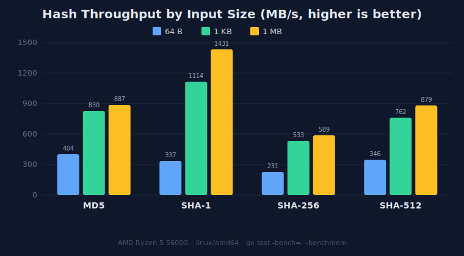
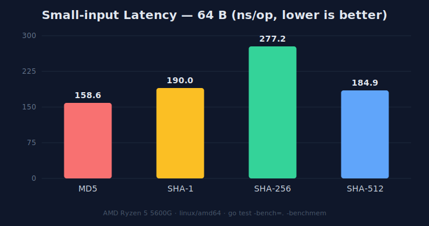

# go-test — Hash Benchmark

Go'nun standart kütüphanesindeki yaygın hash algoritmalarının (MD5, SHA-1,
SHA-256, SHA-512) performansını karşılaştıran basit bir benchmark projesi.
Her algoritma üç farklı girdi boyutuyla (**64 B**, **1 KB**, **1 MB**) ayrı
ayrı ölçülür; böylece hem küçük hem büyük veriler için davranış görülebilir.
Harici bağımlılık yoktur — yalnızca standart kütüphane.

## Benchmark'lar

| Benchmark          | Algoritma | Paket            |
| ------------------ | --------- | ---------------- |
| `BenchmarkMD5`     | MD5       | `crypto/md5`     |
| `BenchmarkSHA1`    | SHA-1     | `crypto/sha1`    |
| `BenchmarkSHA256`  | SHA-256   | `crypto/sha256`  |
| `BenchmarkSHA512`  | SHA-512   | `crypto/sha512`  |

Her benchmark, girdi boyutuna göre alt-benchmark'lara ayrılır:
`BenchmarkSHA256/64B`, `BenchmarkSHA256/1024B`, `BenchmarkSHA256/1048576B`.

## Çalıştırma

```bash
# Tüm benchmark'lar / tüm boyutlar (bellek istatistikleriyle)
go test -bench=. -benchmem

# Tek bir algoritma (tüm boyutlar)
go test -bench=BenchmarkSHA256 -benchmem

# Tek bir boyut (tüm algoritmalar) — alt-benchmark adına göre filtrele
go test -bench=/1024B -benchmem

# Sonuçları bir dosyaya kaydet
go test -bench=. -benchmem | tee bench.txt
```

Her benchmark `b.SetBytes(n)` çağırdığı için `go test` çıktısında ns/op'un
yanında **MB/s** (throughput) değeri de görünür.

## Sonuçlar

Aşağıdaki grafikler ve tablolar gerçek ölçüm sonuçlarıdır.

> Ortam: **AMD Ryzen 5 5600G**, `linux/amd64`, Go benchmark (`-benchmem`).
> Kendi donanımında yeniden üretmek için `go test -bench=. -benchmem` çalıştır —
> donanım hızlandırma (SHA-NI vb.) sayılara doğrudan etki eder.

### Throughput — boyuta göre (MB/s, yüksek olan daha iyi)



### Küçük girdi latency — 64 B (ns/op, düşük olan daha iyi)



### Throughput tablosu (MB/s)

| Algoritma |   64 B |    1 KB |    1 MB |
| --------- | -----: | ------: | ------: |
| MD5       | 403.53 |  829.79 |  886.94 |
| SHA-1     | 336.90 | 1114.04 | 1431.22 |
| SHA-256   | 230.86 |  533.40 |  589.17 |
| SHA-512   | 346.08 |  761.67 |  879.35 |

### Latency tablosu (ns/op)

| Algoritma |  64 B |    1 KB |       1 MB |
| --------- | ----: | ------: | ---------: |
| MD5       | 158.6 |    1234 |  1.182.233 |
| SHA-1     | 190.0 |   919.2 |    732.643 |
| SHA-256   | 277.2 |    1920 |  1.779.763 |
| SHA-512   | 184.9 |    1344 |  1.192.451 |

Tüm ölçümlerde bellek ayırması **0 B/op, 0 allocs/op**.

### Yorum

- **Büyük veride (1 MB) en hızlı SHA-1** (1431 MB/s); MD5 ve SHA-512 birbirine
  yakın (~880 MB/s), **SHA-256 en yavaş** (589 MB/s).
- **Küçük veride (64 B) en hızlı MD5** (158 ns); SHA-256 burada da en yavaş.
- Girdi büyüdükçe throughput artar: küçük girdilerde sabit kurulum maliyeti
  (init/padding) baskınken, büyük girdilerde algoritmanın asıl hızı ortaya çıkar.
- Bu CPU'da **SHA-512, SHA-256'dan belirgin şekilde hızlı** — SHA-512'nin 64-bit
  işlem hattını verimli kullanması ve SHA-256 için donanım hızlandırmanın
  devrede olmaması bunun nedeni.

## Proje yapısı

```
.
├── go.mod
├── hash_benchmark_test.go   # 4 benchmark
├── assets/
│   ├── throughput.svg
│   └── latency.svg
└── README.md
```
